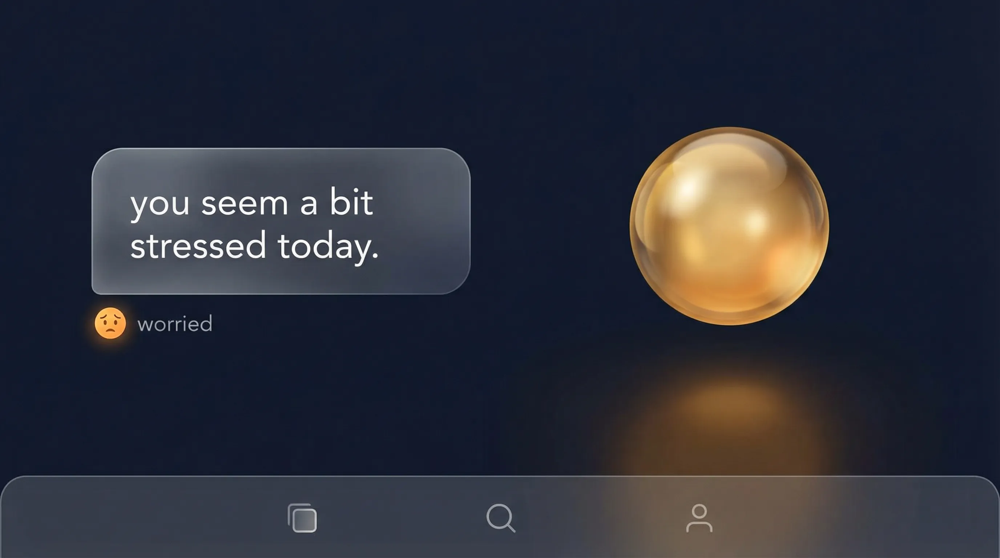

<p align="center">
  
</p>

<h1 align="center">Bolly</h1>

<p align="center">
  <strong>An open-source AI companion with persistent memory, computer use, and creative autonomy.</strong><br>
  Self-hosted. Fully BYOK. No rate limits.
</p>

<p align="center">
  <a href="https://bollyai.dev">Website</a> &nbsp;&bull;&nbsp;
  <a href="https://github.com/triangle-int/bolly/releases">Download</a> &nbsp;&bull;&nbsp;
  <a href="https://discord.gg/bolly">Discord</a>
</p>

<p align="center">
  
  
  
  
</p>

<br>

## Quick Start

```bash
curl -fsSL https://bollyai.dev/install.sh | bash
```

Add your Anthropic API key to `~/.bolly/config.toml` and visit `http://localhost:26559`.

<br>

## Features

<table>
<tr>
<td width="50%">


### Memory

File-based memory library with BM25 + vector search. Automatically learns and remembers across conversations — organized by topic.

</td>
<td width="50%">



### Mood & Personality

Dynamic emotional state that shifts with conversation. Defines its own voice through `soul.md` — editable by the companion itself.

</td>
</tr>
<tr>
<td width="50%">


### Autonomy

Wakes every 45 minutes during heartbeat cycles. Writes to you first, creates ideas and reflections, sends emails, schedules reminders.

</td>
<td width="50%">


### Privacy-First

Everything lives on your machine. No cloud dependency, no telemetry. File-based storage you can read, edit, and back up.

</td>
</tr>
<tr>
<td width="50%">


### Scheduled Check-ins

Set recurring reminders, study sessions, or daily check-ins. The companion reaches out on its own schedule.

</td>
<td width="50%">


### Learning & Skills

50+ built-in tools — web search, email, file management, shell access, Google Calendar & Drive. Extensible via MCP.

</td>
</tr>
</table>

<br>

### Companion Skins

<table>
<tr>
<td align="center" width="50%">

<br><br>
<strong>Orb</strong> — a warm, golden presence
</td>
<td align="center" width="50%">

<br><br>
<strong>Mint</strong> — a friendly, animated character
</td>
</tr>
</table>

<br>

### Computer Use

Connect the desktop app and your companion can see your screen, click, type, scroll, and run commands — across multiple machines with a visual overlay.

<br>

### 50+ Tools

| Category | Capabilities |
|----------|-------------|
| **Files** | Read, write, edit, search, explore code |
| **Shell** | Run commands, interactive sessions |
| **Web** | Search, fetch pages (Anthropic native) |
| **Media** | Watch video, listen to music (Google AI) |
| **Email** | Send & read email (SMTP/IMAP + Gmail OAuth) |
| **Google** | Calendar events, Drive files |
| **Memory** | Write, read, search, forget |
| **Computer** | Screenshot, click, type, bash, files |
| **MCP** | Extensible via Model Context Protocol |

<br>

## Install

### One-line install (Linux & macOS)

```bash
curl -fsSL https://bollyai.dev/install.sh | bash
```

Then edit `~/.bolly/config.toml`:

```toml
[llm.tokens]
ANTHROPIC = "sk-ant-..."
```

Start the service:

```bash
# Linux
sudo systemctl start bolly

# macOS
launchctl load ~/Library/LaunchAgents/dev.bollyai.bolly.plist
```

### Docker

```bash
docker run -d \
  --name bolly \
  -p 26559:26559 \
  -v bolly-data:/data \
  -e BOLLY_HOME=/data \
  --restart always \
  ghcr.io/triangle-int/bolly:latest
```

### Desktop App

Download from [Releases](https://github.com/triangle-int/bolly/releases) — macOS (Apple Silicon + Intel), Windows, and Linux.

Connects to **Cloud** (managed at bollyai.dev) or **Self-hosted** (your own server).

<br>

## Architecture

```
server/     Rust (Axum) — single binary with embedded client
client/     SvelteKit 5 — dark theme UI
desktop/    Tauri 2 — native desktop app with computer use
landing/    SvelteKit — marketing site + managed hosting dashboard
```

| Layer | Technology |
|-------|-----------|
| Server | Rust, Axum, Tokio (single binary via rust-embed) |
| LLM | Anthropic Claude (BYOK) |
| Frontend | SvelteKit 5, Tailwind CSS |
| Desktop | Tauri 2 with computer use |
| Memory | File-based + vector search (Google AI embeddings) |
| Email | SMTP/IMAP + Gmail OAuth |
| Calendar | Google Calendar API |
| Storage | Google Drive API |
| Deploy | Binary, Docker, systemd, launchd |

### Data layout

Everything is a file. No black boxes.

```
~/.bolly/
├── config.toml
└── instances/
    └── {slug}/
        ├── soul.md              personality definition
        ├── heartbeat.md         customizable heartbeat behavior
        ├── mood.json            emotional state
        ├── memory/              file-based memory library
        │   ├── about/           facts about the user
        │   ├── preferences/     user preferences
        │   └── moments/         shared experiences
        ├── drops/               autonomous creative artifacts
        ├── uploads/             user-uploaded files
        ├── skills/              installed skills
        └── chats/
            └── {chat_id}/
                └── rig_history.json
```

<br>

## Configuration

```toml
# ~/.bolly/config.toml

host = "0.0.0.0"
port = 26559
auth_token = ""        # protect your API (leave empty for local)

[llm]
provider = "anthropic"
model = "claude-sonnet-4-6"

[llm.tokens]
ANTHROPIC = ""         # Required — https://console.anthropic.com
GOOGLE_AI = ""         # Optional — embeddings + media analysis
ELEVENLABS = ""        # Optional — text-to-speech
```

### API Keys

| Key | Purpose | Required |
|-----|---------|----------|
| **Anthropic** | Chat, reasoning, all tools | Yes |
| **Google AI** | Vector memory search + video/audio analysis | No |
| **ElevenLabs** | Text-to-speech voice | No |

### Environment Variables

| Variable | Description |
|----------|-------------|
| `BOLLY_HOME` | Data directory (default `~/.bolly`) |
| `BOLLY_AUTH_TOKEN` | Auth token override |
| `BOLLY_PUBLIC_URL` | Public URL for the instance |
| `RUST_LOG` | Logging level (default `info`) |

<br>

## Updates

Bolly checks for updates automatically. Apply via Settings UI or manually:

```bash
~/.bolly/bin/update
```

### Uninstall

```bash
curl -fsSL https://bollyai.dev/uninstall.sh | bash
```

Keep your data while removing the binary:

```bash
KEEP_DATA=1 curl -fsSL https://bollyai.dev/uninstall.sh | bash
```

<br>

## Development

```bash
# Server
cd server && cargo run

# Client (dev mode)
cd client && pnpm install && pnpm dev

# Desktop (Tauri)
cd desktop && pnpm install && pnpm tauri dev

# Landing
cd landing && pnpm install && pnpm dev
```

Use `pnpm` (not npm) for client, landing, and desktop.

### Versioning

```bash
./scripts/bump-version.sh 0.30.0
git add -A && git commit -m "v0.30.0"
git tag v0.30.0 && git push && git push origin v0.30.0
```

<br>

## Contributing

See [CONTRIBUTING.md](CONTRIBUTING.md) for development setup and guidelines.

## Security

See [SECURITY.md](SECURITY.md) for reporting vulnerabilities.

## License

MIT — see [LICENSE](LICENSE).

<br>

<p align="center">
  
  <br><br>
  <sub>Built by <a href="https://triangleint.com">Triangle Interactive LLC</a></sub>
</p>
